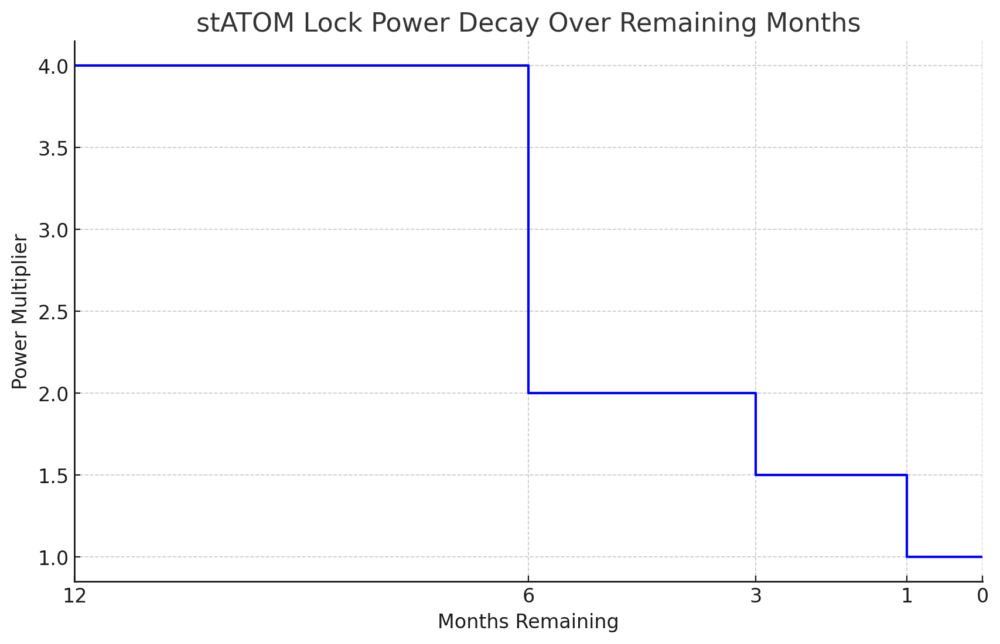
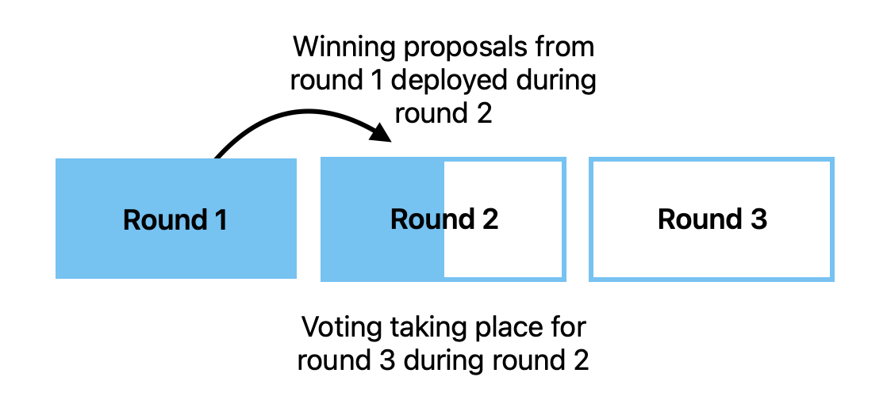

# Atom Wars technical spec

This is an overview of **the first version of** Atom Wars from a technical and user perspective. The code implementing most of the voting system has already been written, but there is still a substantial amount of work to do to allow the contract to handle protocol owned liquidity. This integration will be done by Timewave.

Much of this has already been covered in the original Atom Wars post, but there are some nuances and differences here since this describes the functioning of the actual contract.

# Protocol Owned Liquidity

Atom Wars is a system where Atom stakers can lock up their staked Atoms in exchange for voting power, which they can use to vote on proposals to deploy Atoms owned by the community pool into liquidity (aka market-making) positions on various decentralized exchanges.

Like other “___ Wars” competitions, Atom Wars uses the concept of “gauges”- deployed liquidity is split between proposals proportional to the number of votes that they receive, instead of a winner-takes-all approach.

Atom is commonly used to enter and exit positions of other Cosmos tokens. Supplying more liquidity will help to cement Atom’s role as interchain money. The competition in Atom Wars to secure these PoL spots will generate excitement around Atom, and incentivize holders to lock it up.

Projects using the Cosmos Hub’s Interchain Security platform will receive a gauge multiplier. For a given percentage of the vote, they will receive a higher percentage of the deployed PoL.

# Locking

## Collateral

The first version of Atom Wars will take stAtom as collateral. There has been some opposition to this since there is still debate over whether liquid staking is safe, and Stride (the issuer of stAtom) charges a 10% fee on staking rewards. However, Stride is a consumer chain, and a portion of this fee ultimately goes back to the Hub.

Accepting multiple liquid staking tokens would be complicated and require using an price oracle, and/or querying multiple LST providers before most actions to check how many Atoms each LST represents.

A future version of Atom Wars will let people lock up their Atoms without using a liquid staking token or unstaking from their current validator by using a technology called “LSM shares”, which effectively create a separate denomination for every delegator’s stake on every Hub validator. This is exciting, but non-trivial, since it will require the Atom Wars contract to be able to handle a potentially unlimited number of locked denominations, and it will require Atom Wars to query the Cosmos Hub in several places to validate these denominations whenever a user takes an action.

Until this technology is ready, Atom Wars will institute a cap on the number of stAtoms that can be locked in the contract. This cap will be a fraction of a percent of the total Atom supply, alleviating any security concerns.

## Lock lengths

When a user locks their stAtom, they can select to lock it for different amounts of time. The longer they lock, the more voting power they get.

| stATOM Lock | Power |
| --- | --- |
| 1 month | 1x |
| 3 months | 1.5x |
| 6 months | 2x |
| 1 year | 4x |

Power will decay as time goes by. If a user locks their stAtom for 6 months, their multiplier will stay at 2x until 3 months have passed, then drop down to 1.5x, and so on. This is to make sure that the voters with the longest remaining lockups, hence the most “skin in the game” have the most power at any given time.

# Voting and deployment of PoL

Voting happens in rounds. The length is configurable and still needs to be fully decided, but let’s say rounds are one month for this example.

During a round, anyone can submit a Timewave covenant. This is basically a specification for a liquidity position which will be deployed if the proposal gets enough votes.

Once the round is over, proposals are deployed using Timewave, a product which automates DeFi processes. Currently it supports liquidity provision on Astroport and Osmosis. The amount of liquidity deployed to each proposal is based on how many votes it gets and any liquidity multipliers related to the project’s use of Interchain Security.

# Tribute

The Atom Wars forum post mentions “tribute”- funds that proposal creators can attach to proposals which is paid out to the winning proposal. This is not implemented within the main Atom Wars contract, but it is possible for tribute to be awarded with pluggable tribute contracts that read from the Atom Wars contract. These can be switched out permissionlessly and even customized or reinvented by proposal authors.

We will deploy an example default tribute contract which pays out tribute to anyone who voted for a proposal- but only if that proposal wins. This can be used as is by proposal authors, or used as a starting point for custom tribute contracts.
